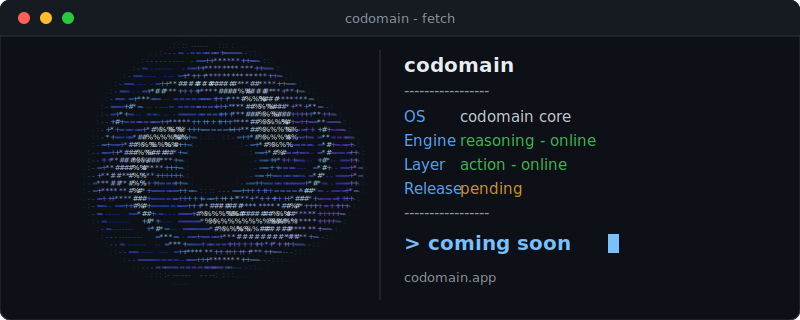

<h1>{codomain}</h1>

  <em>
    Developing intelligent systems that transform information into understanding, reasoning, and action.
  </em>

 

   

#### Handles

  
  &nbsp;&nbsp;
  
  &nbsp;&nbsp;
  
  &nbsp;&nbsp;
  
    
  
  &nbsp;&nbsp;
  

